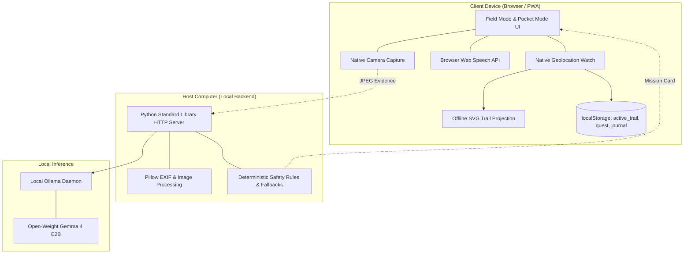

# WILDSTEP AI

**Local AI. Real-world missions. Zero scrolling.**

Developer & Maintainer: **Nainish Jaiswal**  
License: **MIT** · Open-Weight Model: **Google Gemma 4 E2B (via Ollama)**

> Modern AI products keep people glued to glowing screens.  
> **WildStep AI uses local open-weight AI to do the exact opposite: give people a reason to put the phone down, head outdoors, and observe the physical world.**

---

## WildStep in 30 Seconds

```text
       Enter walking context (place, season, companions)
                              ↓
        Local Gemma AI synthesizes a 6-item mission
                              ↓
          Step outside · Phone locked in pocket
                              ↓
        Hear spoken missions · Observe nature live
                              ↓
        Snap camera evidence · Local AI evaluates
                              ↓
   On-device GPS records trail · Zero cloud upload
                              ↓
        Inspect verified journal & offline SVG map
```

---

## Why WildStep?

### 🧠 Local Open-Weight AI
Powered by Google's open-weight **Gemma 4 E2B** running locally through **Ollama**. Zero API keys, zero cloud inference costs, and zero external network latency.

### 🌲 Real-World Physical Interaction
Instead of generating digital feeds to consume, WildStep synthesizes real-world observational missions that demand physical movement and mindful outdoor presence.

### 📍 Local-First GPS Trail
A built-in Live GPS Trail engine filters jitter and projects your path directly into dynamic vector SVG. Coordinates are processed client-side and never leave your device.

### 📷 Local Evidence Verification
Capture discoveries with your device's native camera. An on-device multimodal vision judge evaluates evidence descriptions without uploading photos to any cloud.

### 🔒 Local-First Privacy Architecture
Coordinates are processed client-side and never sent in API payloads or Ollama prompts. No remote map tiles, analytics beacons, or cloud AI endpoints are utilized. Photos remain on the host device.

### 📱 Field-First Ergonomics
High-contrast sunlight-readable **Outdoor Field Mode**, native browser **Voice Mode**, haptic confirmations, single-tap **OLED Pocket Mode**, and installable **PWA** support eliminate screen distraction.

---

## Feature Matrix

| Capability | WildStep AI |
|---|:---:|
| Local open-weight AI | ✅ |
| Gemma via Ollama | ✅ |
| Local image processing | ✅ |
| Client-side GPS | ✅ |
| Offline trail visualization | ✅ |
| Voice interaction | ✅ |
| Haptic feedback | ✅ |
| Outdoor Field Mode | ✅ |
| OLED Pocket Mode | ✅ |
| Installable PWA | ✅ |
| Deterministic safety filtering | ✅ |
| Deterministic demo runner | ✅ |
| Cloud AI required | ❌ |
| Remote map tiles required | ❌ |
| Analytics tracking | ❌ |

---

## Why WildStep Fits "Touch Grass"

The hackathon theme asks: *How can technology encourage healthier real-world living?*

Most AI systems treat the user as an eyeball to keep retained on a screen:
* Social feeds maximize time spent scrolling.
* Chatbots reward longer typing sessions.
* Generative AI encourages infinite media generation.

**WildStep AI inverts the interaction model:**
```text
      AI Interaction: 2 minutes (Prepare personalized outdoor mission)
                                ↓
      Physical Movement: 60 minutes (Walk, observe nature, listen to audio)
                                ↓
      Review & Journal: 2 minutes (Inspect verified discoveries and trail)
```

The technology acts strictly as an **igniter for outdoor exploration**, not a destination. You prepare on the screen, hear the objective, put the phone away, and connect with nature.

---

## Judge Quickstart

Experience WildStep AI in under two minutes on any standard laptop or workstation.

### Requirements
- **Python 3.10+**
- **Pillow** (`pip install -r requirements.txt`)
- *(Optional for live LLM)*: **[Ollama](https://ollama.com)** with `ollama pull gemma4:e2b`

*(If Ollama is not running, WildStep AI automatically falls back to curated deterministic offline missions, allowing complete evaluation without model downloads).*

### Launch the Application

```powershell
# 1. Install dependencies
pip install -r requirements.txt

# 2. Start the local server
python server.py
```

Open your browser to:
```text
http://127.0.0.1:8777
```

### Live Experience Walkthrough
1. **Health Banner:** Confirm `WildStep Ready · App shell ready · Local AI: Available` (or deterministic offline fallback mode).
2. **Generate Mission:** Click **"Quick Mission (instant)"** or enter a local park (e.g., *"Central Park, spring"*) and click **"Generate Mission"**.
3. **Launch Field Mode:** Click **"🥾 Outdoor Field Mode"** to enter the high-contrast outdoor HUD.
4. **Enable GPS & Voice:** Allow location tracking to activate the live GPS trail bar and toggle **"🔊 Voice On"** for spoken guidance.
5. **Snap Evidence:** Click **"📷 SNAP EVIDENCE"** and upload any sample from `samples/` (e.g. `samples/acridotheres-tristis.jpg`). Notice local analysis, haptic pattern, and automatic mission progression.
6. **Inspect Trail & Summary:** Tap **"Trail View"** to inspect the live SVG path, then **"✕ Exit"** to view the Adventure Summary modal and the permanent chronological Journal.

---

## One-Command Deterministic Demo

Want to inspect every architectural layer without walking outside or starting Ollama?

```powershell
python scripts/run_demo.py
```

The deterministic demo runner runs in **~1.5 seconds**, exercises genuine production logic, and outputs verifiable artifacts to `demo_output/`:

```text
================================================================
 WILDSTEP AI — DETERMINISTIC DEMO RUNNER
 Local AI. Real-world missions. Zero scrolling.
 Developer & Maintainer: Nainish Jaiswal
================================================================
 [1] DEMO SCENARIO CONFIGURATION
     Location:   Vetal Tekdi, Pune, Maharashtra
     Season:     October (Post-Monsoon Autumn)
     Companion:  Solo nature walker
 [2] SAFETY RULES & DETERMINISTIC FILTERING (REAL CODE)
     [REJECTED] Unsafe objective: 'Climb up the steep rocky cliff edge' -> Filtered
     [CAUTION]  Mushroom objective: 'Wild mushrooms on rotting wood' -> Tagged photo-only
     [ACCEPTED] Low-risk objective: 'A bird resting on a tree branch'
 [3] MISSION GENERATION & SELECTION
     Title:          Vetal Hill Nature Trail (6 validated quests)
 [4] EVIDENCE VERIFICATION (REAL PREPROCESSING + FIXTURE JUDGE)
     Fixture File:   samples/acridotheres-tristis.jpg
     AI Evaluation:  Common Myna bird in dry grass -> VERIFIED (+15 pts)
 [5] LIVE GPS TRAIL MODE (REAL FILTERING & HAVERSINE MATH)
     Raw Points: 9 | Points Kept: 8 | Points Dropped: 1 (accuracy > 65m filter)
     Distance: 782 m | Elapsed: 09:20 | Pace: 11:56 / km
 [6] GPS PRIVACY ARCHITECTURE VERIFICATION
     ✓ Coordinates computed purely client-side
     ✓ Zero coordinates sent in /api/* request payloads
     ✓ Zero coordinates transmitted to Ollama prompts
     ✓ Zero external map tiles or remote mapping APIs utilized
 [7] VECTOR TRAIL VIEW PROJECTION (REAL SVG RENDERER)
 [8] ISOLATED DEMO ARTIFACT CREATION
     Rendered SVG:   demo_output\trail.svg
     Saved Journal:  demo_output\demo_journal.json
================================================================
```

### Production Code vs. Demo Fixtures
* **Real Production Code Exercised:**
  - Regex safety rules (`UNSAFE`, `PHOTO_ONLY`) and fallback pool swaps.
  - Multi-objective vision evidence verification scoring logic.
  - Geolocation accuracy filtering ($\le 65\text{m}$), jitter deduplication ($< 2\text{m}$), and velocity jump rejection ($> 12\text{m/s}$).
  - Spherical Haversine distance calculations and gated pace estimation.
  - Offline mathematical SVG projection (`START` and `YOU` markers).
  - Chronological field journal compilation.
* **Deterministic Fixtures (No External Dependencies):**
  - Scenic trail GPS coordinates from Vetal Tekdi.
  - Sample nature photograph (`samples/acridotheres-tristis.jpg`).
  - Fixed timestamp (`2026-10-08T10:00:00Z`).
  - Deterministic model JSON response matching `QUEST_SCHEMA`.

---

## 3-Minute Judge Demo Script

If presenting WildStep AI to a judging panel or interviewer, use this high-impact walkthrough:

* **0:00 — The Problem (20s):**  
  *"Most outdoor apps do the opposite of what they promise: they keep you staring at a screen while hiking. WildStep uses local open-weight AI to give you a reason to put the phone in your pocket and touch grass."*
* **0:20 — Landing & Local AI (25s):**  
  Show the landing page. Point to the Local AI status badge. Emphasize that all intelligence runs on-device through Ollama with Google's Gemma model—zero cloud APIs, zero subscriptions, zero coordinate tracking.
* **0:45 — Start a Walk (30s):**  
  Click *Quick Mission* or generate a custom expedition. Show the 6-item nature scavenger card. Click *🥾 Outdoor Field Mode*.
* **1:15 — The Outdoor Field HUD (35s):**  
  Highlight the sunlight-readable high-contrast interface. Toggle *🔊 Voice On* to hear spoken objective audio. Show *🌙 Pocket Mode* locking the display to pitch black (`#000`) for OLED power savings.
* **1:50 — Camera Evidence & Local Vision (35s):**  
  Click *📷 SNAP EVIDENCE* and upload a photo. Show the local multimodal judge evaluating the evidence and awarding points with dual-pulse haptic feedback.
* **2:25 — Live GPS Trail & Adventure Summary (35s):**  
  Toggle *Trail View* to show the mathematically projected SVG route. Exit Field Mode to reveal the complete Adventure Summary (distance, time, pace, objectives completed) and the permanent local Journal.
* **3:00 — Wrap-Up:**  
  *"Zero cloud dependencies. Local-first privacy. An AI application that measures success by how little you look at the screen."*

---

## How the Local AI Works

WildStep AI pairs local open-weight LLM generation with deterministic safety validation. Model output is never blindly trusted.

```text
               User Walking Context (Location, Season, Group)
                                     ↓
               Deterministic Input Sanitization & Safety Check
                                     ↓
                     Ollama Local Inference Engine
                 [Google Gemma 4 E2B Quantized Model]
                                     ↓
             Constrained JSON Schema Grammar (QUEST_SCHEMA)
                                     ↓
               Deterministic Post-Processing & Normalization
        (Unsafe actions replaced with safe pool; cautions appended)
                                     ↓
                     Structured 6-Item Mission Card
                                     ↓
                     Camera Discovery Captured in Field
                                     ↓
                    Local Preprocessing (Pillow Downsampling)
                                     ↓
                  Multimodal Gemma Judge via Local Ollama
         (Answers: Is subject present? Is it main subject? What is evidence?)
                                     ↓
               Dual-Condition Points Awarded & Journal Entry
```

### Safety Filters: Deterministic Code Over Heuristics
1. **Blacklist (`UNSAFE` regex):** Discards objectives suggesting climbing steep cliffs, swimming, entering water, touching wildlife, tasting plants, night exploration, or walking along railway tracks.
2. **Caution Injection (`PHOTO_ONLY` regex):** Automatically appends `(photo only, don't touch)` to mushrooms, fungi, wild berries, nests, or animal habitats.
3. **Fallback Pool (`SAFE_POOL`):** Any objective rejected by safety or failing JSON parsing is replaced with verified safe nature observation prompts.

---

## Your Data Stays With You (Local-First Privacy Architecture)

```text
                  YOUR PERSONAL DEVICE
   ┌────────────────────────────────────────────────────────┐
   │                                                        │
   │   📷 Camera Photos ─────────┐                          │
   │                             ↓                          │
   │   🛰️ GPS Coordinates ─── WildStep AI Core Engine       │
   │                             │                          │
   │                             ↓                          │
   │                      Local Gemma AI                    │
   │                   (via Ollama Daemon)                  │
   │                             │                          │
   │                             ↓                          │
   │            Local SVG Trail & Browser Storage           │
   │                                                        │
   └────────────────────────────────────────────────────────┘

              ✕ Zero photo uploads to cloud
              ✕ Zero GPS coordinate transmission
              ✕ Zero remote map tile downloads
              ✕ Zero cloud LLM endpoints
              ✕ Zero analytics tracking beacons
```

### Data Flow Audit

| Data Stream | Handling & Destination | External Cloud / Network |
|---|---|---|
| **Camera Photos** | Processed in host RAM; downsampled locally for Gemma | **None** (never uploaded to cloud or CDNs) |
| **GPS Coordinates** | Filtered and projected client-side into vector SVG | **None** (never sent to server, Ollama, or third parties) |
| **AI Inference** | Executed purely on local Ollama daemon | **None** (100% open-weight local model) |
| **Voice Guidance** | Synthesized using client browser SpeechSynthesis | **None** (device-native text-to-speech) |
| **Live Trail** | Stored in browser `localStorage` on device | **None** (remains on client hardware) |
| **Mapping Providers** | Dynamic SVG geometry computed mathematically | **None** (no Google Maps, Leaflet, Mapbox, or OSM tiles) |
| **Analytics & Telemetry**| Zero tracking scripts, zero cookies, zero pixels | **None** |

---

## Technical Highlights

### 1. Artificial Intelligence & Local Vision
- **Constrained Grammar Decoding:** Enforces strict JSON Schema compliance in Ollama to eliminate hallucinated formatting or markdown drift.
- **Multimodal Scavenger Hunt Judge:** Prompted not for fragile fine-grained taxonomy, but as an impartial judge checking subject prominence, verifiable visual evidence, and clarity.
- **Defensive Fallback Architecture:** If Ollama is offline or uninstalled, the system transitions gracefully to deterministic catalog missions with zero crashes.

### 2. Client-Side Geospatial Math
- **Spherical Haversine Formulation:** Great-circle distance calculated on-device using precise Earth radius constants ($R = 6,371,000\text{m}$).
- **Three-Tier GPS Quality Filter:** Discards readings with accuracy $> 65\text{m}$, deduplicates stationary jitter ($< 2\text{m}$), and drops cellular tower jumps ($> 12\text{m/s}$ over $> 30\text{m}$).
- **Tile-Free SVG Vector Projection:** Normalizes geographic bounding boxes with Mercator latitude scaling ($k = \cos(\text{midLat})$) to render crisp vector trails without requesting a single map tile.

### 3. Progressive Web App & Offline Architecture
- **Cached Application Shell:** Service worker (`static/sw.js`) pre-caches core static assets for instant standalone boot without an active internet connection.
- **Strict Privacy Isolation:** The service worker never caches user photos or `/api/*` endpoints.

---

## Full Architecture



---

## Why Open Innovation Matters

WildStep AI is intentionally built with open-weight models and standard open web technologies:
1. **User Ownership:** Outdoor exploration is personal. Your nature discoveries, walk times, and locations belong to you, not a cloud provider's training pipeline.
2. **True Wilderness Resilience:** State parks, mountains, and forest trails often have limited or absent cellular coverage. Open-weight models running on local hardware ensure functionality without remote cloud reliance.
3. **Transparency & Inspectability:** Every safety rule, image transform, and distance formula in WildStep is open, auditable, and reproducible.
4. **Zero Marginal Cost:** Exploring outdoors should be free. Running local models eliminates token fees, API keys, and paywalls.

---

## Product Screen Capture Guide

When preparing pitch decks, hackathon submissions, or video demonstrations, capture these key application screens:

1. **Home / Hero Screen:** Showcase the clean brand bar, local AI status indicator, and Expedition Plan form.
2. **Mission Generation Card:** Show the seasonal 6-objective scavenger hunt with point rewards and emoji markers.
3. **Outdoor Field Mode HUD:** Display the sunlight-readable dark green HUD, active objective counter, and elapsed walk timer.
4. **Live GPS Trail Drawer:** Show the real-time distance, pace meter, and mathematically projected SVG route drawer.
5. **OLED Pocket Mode:** Demonstrate the pure `#000` screen lock with dim clock for pocket battery savings.
6. **Camera Evidence Verification:** Capture the instant verification feedback showing detected evidence and points awarded.
7. **Adventure Summary & Journal:** Display the walk completion dialog and the final chronological photo journal with route polyline.

---

## Interview Talking Points

Concise, high-impact responses for technical questions:

* **Why local AI instead of cloud models?**  
  *Wilderness trails frequently have zero cellular connectivity, and personal outdoor journeys shouldn't require paying cloud API subscriptions. Local open-weight models bring intelligence directly to the edge.*

* **Why Google's Gemma 4 E2B?**  
  *Gemma 4 E2B provides an ideal balance of compact parameter size, low local resource footprint, and multimodal vision capabilities. It fits comfortably on consumer laptops and edge hardware while offering reliable instruction following.*

* **Why not use Google Maps or Mapbox tiles?**  
  *Remote mapping SDKs track user coordinates and require downloading megabytes of raster tiles that fail completely offline. WildStep's pure SVG engine projects coordinates into crisp vector polylines mathematically with zero network requests.*

* **How do you guarantee physical safety?**  
  *We never trust LLM output alone for physical safety. Deterministic regex rules intercept dangerous activities like cliff climbing or water entry, caution notices are automatically appended to fungi, and any flagged objective is replaced with a verified safe catalog item.*

* **What happens if Ollama is not installed or crashes?**  
  *WildStep degrades gracefully. The UI immediately reports offline status and switches to a deterministic built-in catalog of seasonal outdoor missions. The entire app—including camera, GPS, and journal—continues working without a hitch.*

* **What was the hardest engineering challenge?**  
  *Balancing multimodal vision accuracy with extreme privacy and zero latency. We solved this by prompting Gemma as an observational scavenger hunt judge focused on subject prominence rather than brittle taxonomy, backed by strict client-side GPS filtering to prevent distance drift.*

* **What would you build next?**  
  *On-device quantized audio generation for interactive nature soundscapes, and local peer-to-peer Bluetooth mesh syncing so walking groups can share trails without internet.*

---

## Automated Test Suite

WildStep AI is backed by an automated, deterministic test suite:

```powershell
python -m pytest -q
```

**Result: 133 passed in ~10 seconds** (0 failures, 0 warnings).

The test suite validates:
- Deterministic outdoor safety filters and fallback generation (`tests/test_safety.py`)
- HTTP endpoints, headers, and request contracts (`tests/test_http_api.py`, `tests/test_server.py`)
- EXIF parsing, coordinate extraction, and SVG route math (`tests/test_exif.py`, `tests/test_svg.py`)
- Outdoor Field Mode, Pocket Mode, and voice guidance (`tests/test_field_mode.py`, `tests/test_voice_mode.py`)
- PWA manifest, service worker caching, and offline app shell (`tests/test_pwa.py`)
- Live GPS trail calculation, jitter filtering, jump rejection, and privacy (`tests/test_trail_mode.py`)
- Deterministic Demo Runner pipeline (`tests/test_demo_runner.py`)

---

## License & Attribution

WildStep AI is open-source software released under the **MIT License**.

* **WildStep AI Code & Architecture:** Copyright (c) 2026 **Nainish Jaiswal**.
* **Third-Party Media:** Nature sample photographs from Wikimedia Commons under Creative Commons licenses.

For complete license text, see [`LICENSE`](LICENSE).  
For detailed component provenance, see [`ATTRIBUTIONS.md`](ATTRIBUTIONS.md).  
For third-party photo credits, see [`samples/CREDITS.md`](samples/CREDITS.md).
