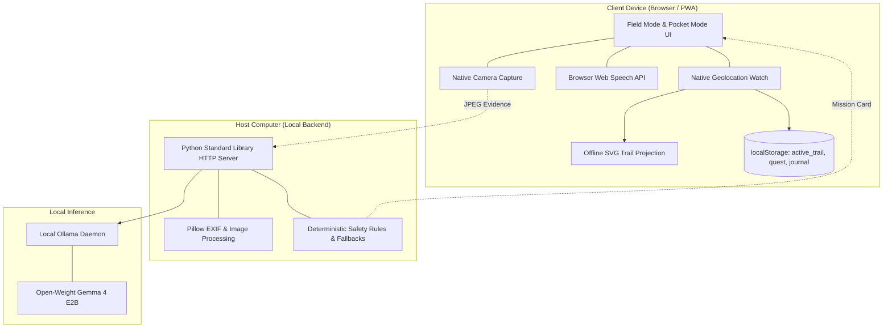

# WildStep AI

**Local AI. Real-world missions. Zero scrolling.**

Developer & Maintainer: **Nainish Jaiswal**

> WildStep AI is an offline-first outdoor companion powered by local open-weight AI. It prepares personalized real-world missions, helps verify discoveries, and creates a local adventure journal — while deliberately minimizing the time the user spends looking at a screen.

---

## Judge Quickstart

### What is WildStep AI?
WildStep AI is an outdoor companion that uses local open-weight AI (Gemma via Ollama) to prepare personalized nature scavenger hunts, helps you explore with your phone in your pocket, verifies camera evidence locally, and tracks your physical journey without external maps, cloud APIs, or screen scrolling.

### Prerequisites (Clear Distinction)

**Required for Full Local AI:**
- **Python 3.10+** (standard library HTTP server; only `Pillow>=10` required)
- **[Ollama](https://ollama.com)** running locally on `http://127.0.0.1:11434`
- **Gemma model**: `ollama pull gemma4:e2b`

**Required for Deterministic Offline / Fallback Use:**
- **Python 3.10+** and `pip install -r requirements.txt`
*(If Ollama is not installed or offline, WildStep automatically runs using deterministic built-in fallback missions).*

**Optional:**
- **Temporal**: `temporal server start-dev` (only if you want background workflow durability for batch photo checks; not needed for standard walking and Field Mode).

### How do I run it?

```bash
# 1. Install dependencies
pip install -r requirements.txt

# 2. (Optional, for full AI inference) Pull local model
ollama pull gemma4:e2b

# 3. Start WildStep AI
python server.py
```
Open **`http://127.0.0.1:8777`** in your browser.

### How do I experience the main demo?

1. **Check Status**: Notice the readiness indicator at the top: `WildStep Ready · App shell ready · Local AI: Available` (or `Local AI: Offline ... Fallback missions available`).
2. **Prepare Mission**: Click **"Quick mission"** for an instant local card, or enter your park/season and click **"Make a new mission"**.
3. **Start the Walk**: Tap **"Start Walk"** or **"Outdoor Field Mode"**.
4. **GPS Choice**: Select **"Enable Trail"** to record your walking route locally (or **"Walk Without GPS"**).
5. **Field Mode & Voice**: Review the first objective. Tap **"🔊 Voice On"** to hear spoken guidance.
6. **Capture Evidence**: Tap **"📷 SNAP EVIDENCE"** and take/select a photo. Notice haptic and immediate AI feedback.
7. **Trail View**: Tap **"Trail View"** in the top bar to inspect your live offline SVG route path.
8. **Complete & Journal**: Tap **"Exit Field Mode"** to view your Adventure Summary dialog and review your permanent local Journal.

### Does it require API keys?
> **No.** No external AI, cloud vision, or map API keys are required.

### Where does the AI run?
> **100% locally on your machine.** AI inference runs strictly through your local Ollama daemon. No prompts, images, or observations leave your device.

### Where does location data go?
> **GPS trail data stays on your device.** Live coordinates are processed client-side and saved only in local browser storage (`localStorage`). Coordinates are never sent to Ollama, the Python server, or any third party.

---

## Running the Deterministic Demo

For interviews, automated evaluation, or local verification without walking outside, WildStep AI provides a **deterministic demo runner**:

```bash
python scripts/run_demo.py
```

### Why Demo Mode Exists
- Demonstrates the complete end-to-end WildStep flow in seconds.
- Does **not** require an active Ollama instance, GPU, internet connection, camera hardware, or physical outdoor movement.
- Completely isolated: writes artifacts exclusively to `demo_output/` (`trail.svg`, `demo_journal.json`) without mutating real user data or production state.

### Real vs. Simulated Components
- **REAL (Production Logic Exercised):**
  - Deterministic safety regex rules (`UNSAFE`, `PHOTO_ONLY`) and fallback pool swaps.
  - Multi-objective photo verification schema constraints and scoring thresholds.
  - Geolocation accuracy thresholds ($acc \le 65\text{m}$), stationary jitter deduplication ($< 2\text{m}$), and jump rejection ($> 12\text{m/s}$).
  - Spherical Haversine distance calculation and gated pace formatting.
  - Offline vector SVG projection with start marker, current position marker, and aspect ratio normalization.
  - Local walk journal compilation.
- **SIMULATED (Demonstration Fixtures):**
  - Fixed GPS trail coordinates (scenic nature walk along Vetal Tekdi in Pune, Maharashtra).
  - Deterministic image fixture (`samples/acridotheres-tristis.jpg`).
  - Fixed demo timestamp (`2026-10-08T10:00:00Z`).
  - Mocked open-weight LLM responses validating the exact JSON schema.

---

## Interview Showcase (3–5 Minute Walkthrough)

When demonstrating WildStep AI in a technical interview:

1. **The Problem (30s):** Outdoor apps often trap people into staring at screens, feeds, and inaccurate species classifiers while hiking. WildStep's philosophy is *"Prepare on the screen. Listen to the mission. Put the phone away. Touch grass."*
2. **Local AI Architecture (30s):** Explain that WildStep runs entirely offline on-device with open-weight Gemma via local Ollama. Zero cloud APIs, zero subscription fees.
3. **Execute the Demo (30s):** Run `python scripts/run_demo.py` in the terminal to showcase the full pipeline synchronously.
4. **Safety Pipeline (45s):** Point out how AI suggestions are never trusted blindly; deterministic code flags unsafe activities (cliffs, climbing, water, wildlife touching) and appends caution warnings to mushrooms or berries.
5. **Local Evidence Verification (45s):** Explain that the local multimodal judge requires both `is_main_subject=True` and concrete evidence descriptions to award points, preventing background noise from scoring.
6. **Privacy-First GPS (45s):** Highlight Live GPS Trail Mode: coordinates are filtered and projected into vector SVGs purely on the device. Coordinates are never sent in HTTP request bodies or LLM prompts.
7. **PWA & Field Mode (30s):** Show that WildStep installs as a standalone PWA with an offline app shell, spoken voice guidance, and OLED Pocket Mode.

---

## What is WildStep AI?

WildStep AI turns outdoor walks into focused real-world discovery sessions without screen addiction. The verified application workflow operates as follows:

1. **User enters an outdoor location and context:** Provide where you plan to walk (e.g., local park, lake trail, neighbourhood) and who is joining (e.g., solo, with children).
2. **Local Gemma generates an outdoor scavenger mission:** A local open-weight model writes a 6-item mission card adapted to the actual geographical context, current month, and seasonal climate.
3. **User receives the mission:** The card presents concrete, visible outdoor objectives with assigned point values and emojis. Users can inspect the card or use browser print to take a physical paper copy.
4. **User enters Phone Away mode:** Triggering the departure timer opens a dedicated full-screen lockout view designed to keep the phone in your pocket during the walk.
5. **User goes outside:** The user walks outdoors with their phone put away, only retrieving the device to take photos of discoveries.
6. **User photographs discoveries:** Native camera photos capture nature elements without any immediate in-field appraisal or scrolling.
7. **Local vision inference evaluates evidence:** Back home, the user drops photos into the application. A local multimodal vision model evaluates each photograph against active mission objectives.
8. **EXIF/GPS information is processed locally:** Camera capture timestamps and geographic coordinates embedded in the photo headers are extracted and validated entirely on the local machine.
9. **The application produces a local walk journal and route visualization:** A chronological field journal is generated alongside an offline SVG route map linking the photo locations.

---

## Why WildStep AI?

Modern mobile outdoor applications frequently produce the opposite of their intended effect: users spend their time outdoors staring at screens, checking feeds, consulting social leaderboards, or arguing with inaccurate classifiers.

WildStep AI is built on a distinct design principle:

> **The application is designed to use AI briefly so that the user can spend more time away from the screen.**

You spend two minutes with AI before leaving, keep the device in your pocket for an hour while exploring the physical world, and spend two minutes reviewing your verified discoveries upon returning.

---

## Local AI

WildStep AI relies entirely on local open-weight models executed on your hardware:

* **Inference Engine:** Powered by [Ollama](https://ollama.com), running locally over `http://127.0.0.1:11434`.
* **Model:** Default configured to Google's open-weight `gemma4:e2b` (quantized local vision and instruction model), configurable via `QUEST_MODEL`.
* **Structured Generation:** Mission generation enforces strict JSON Schemas (`QUEST_SCHEMA`) through Ollama's constrained grammar generation, preventing broken output formats.
* **Local Vision Evidence Verification:** Rather than performing brittle fine-grained species identification that frequently misleads users, the model is prompted as an impartial scavenger hunt judge. It answers coarse observational questions: *Is the requested subject clearly present? Is it the main subject of the frame? What is the specific visible evidence?* Points are awarded only when both the completion flag and main-subject flag are validated with concrete evidence descriptions.

---

## Privacy

* **Zero Cloud APIs:** No OpenAI, Google Cloud, Anthropic, or remote telemetry endpoints.
* **Photos Never Leave Your Machine:** All image files are read, downsampled, and evaluated directly in host memory or local storage.
* **Location Data Remains Private:** GPS coordinates extracted from photo EXIF tags are processed locally and rendered into self-contained vector paths. No mapping provider ever receives your location traces.

---

## Offline Operation

WildStep AI is architected from the ground up to operate without an active internet connection once initial dependencies and models are downloaded:

* **Zero Remote Assets:** No external CDNs, remote web fonts, analytics beacons, or remote style libraries. All assets are served from the local HTTP server.
* **Tile-Free Route Rendering:** Route maps are generated using an internal mathematical projection into pure SVG polylines directly from photo GPS coordinates. No map tile downloads (OpenStreetMap, Mapbox, Google Maps) are needed.
* **Offline App Shell:** Service worker pre-caches the complete frontend shell, icons, and manifest, enabling the application interface to load reliably even when disconnected from the network.
* **Runtime Locality:** All LLM inference, EXIF extraction, and journal construction run on the local machine.

---

## Current Features

* **Installable PWA & Offline App Shell:** Standard Web App Manifest, custom responsive icons, and versioned service worker shell caching (`wildstep-shell-v1`) for standalone mobile installation.
* **Outdoor Field Mode:** A dedicated, high-contrast, sunlight-readable, zero-scrolling UI for in-field exploration. Features direct camera capture, haptic feedback, auto-advance, walk timer, and an OLED Pocket Mode screen lock.
* **Voice-First Field Mode:** Native browser text-to-speech audio guidance announcing active missions, in-pocket progress, and verification feedback without cloud dependencies.
* **Contextual Mission Synthesis:** Synthesizes balanced 6-objective outdoor scavenger missions tailored to season, biome, and walking companions.
* **Instant Fallback Missions:** Instant non-LLM mission generation sourced from a curated internal safe pool.
* **Phone Away Mode:** Dedicated full-screen focus overlay recording start time and discouraging in-walk screen usage.
* **Dual-Condition Vision Verification:** Checks whether an item is present, whether it represents the main subject, and whether verifiable evidence exists.
* **EXIF Date & GPS Extraction:** Automatically reads photo capture timestamps (`DateTimeOriginal`) and geolocation coordinates (`GPSInfo`).
* **Offline Vector Route Map:** Plots walk path geometry and calculates total distance between photographic waypoints using pure mathematical SVG.
* **Chronological Walk Journal:** Visual timeline organizing photographs, capture times, verified mission badges, and missing metadata warnings.
* **Optional Durable Execution (Temporal):** Optional fault-tolerant batch photo processing backed by an embedded local Temporal dev server, allowing browser tabs to close during long verification batches.

---

## Outdoor Field Mode

Outdoor Field Mode implements WildStep AI's core philosophy: **"Prepare on the screen. Then put the phone away."**

When walking outdoors, users need minimal screen interaction, maximum sunlight legibility, and zero distractions:

* **Sunlight-Readable High-Contrast Design:** Glare-resistant dark green/black canvas (`#081107`) with neon status accents (`#4ade80`) and oversized typography legible even in harsh outdoor sunlight.
* **Zero Scrolling Layout:** Single-screen viewport layout (`100dvh`) with safe-area insets (`env(safe-area-inset-*)`) and touch-optimized controls ($\ge 48\text{px}$ touch targets).
* **Focused Single-Mission View:** Displays one objective at a time (e.g. `MISSION 2 OF 6 · 150 PTS`, large emoji, objective description) with simple Previous/Next navigation.
* **Direct Native Camera Capture:** Integrated `<input type="file" accept="image/*" capture="environment">` directly launches the phone camera without file picker detours.
* **Immediate Local Verification & Haptics:** Snapped evidence is sent directly to the local `/api/check` vision pipeline. Provides dual-pulse success haptics (`navigator.vibrate`) on verification and informative retry guidance when objectives are not detected.
* **Auto-Progression:** Automatically advances to the next unfinished outdoor objective upon successful verification.
* **OLED Pocket Mode:** One-tap screen lock that drops display output to pure `#000` black with a dim clock, eliminating accidental touches inside pockets and maximizing battery life on OLED panels.
* **Elapsed Walk Timer:** Tracks active outdoor exploration duration continuously across mode switches.

---

## Voice-First Field Mode

WildStep AI expands the outdoor experience with **Voice-First Field Mode**, designed around the expanded philosophy:

> **"Prepare on the screen. Listen to the mission. Put the phone away. Touch grass."**

Voice guidance allows users to keep their eyes up and phones in their pockets throughout exploration:

* **100% Local Native Speech Synthesis:** Powered entirely by the client browser's native `window.speechSynthesis` and `SpeechSynthesisUtterance`. Zero remote TTS APIs (no ElevenLabs, Google Cloud, Azure, or OpenAI speech services), zero audio files, and zero external CDNs.
* **Spoken Mission Announcements:** Concisely announces the active objective (e.g., *"Mission one. Find a leaf larger than your hand."*) without reading technical metadata, points, or verbose model instructions.
* **In-Pocket Verification Audio:** Provides immediate spoken feedback after photo capture:
  - **Success:** *"Mission complete. Nice find. Next mission. [Next objective]."*
  - **Retry Guidance:** *"Not enough evidence. AI saw [observation]. Try another photo."*
  - **Walk Completion:** *"Walk complete. You finished all six missions."*
* **Seamless Pocket Mode Integration:** Operates together with OLED Pocket Mode so users can hear mission updates and capture feedback without taking the phone out to inspect the screen.
* **Speech Queue Management & Sanitization:** Automatically cancels in-progress speech when new events trigger to prevent audio overlap. All spoken text is sanitized to strip HTML, JSON, raw prompts, and runaway LLM reasoning.
* **Autoplay & Permission Safety:** Voice is disabled by default to respect browser autoplay policies; enabling it requires an explicit user gesture (`🔊 Voice On`).
* **Graceful Degradation:** When `window.speechSynthesis` is unavailable (e.g. specialized mobile browsers, headless environments), voice controls clearly indicate `🔇 Voice N/A` and all visual/haptic features continue functioning completely without degradation.

*(Note: Voice availability depends on client browser and operating system support for the Web Speech API. Modern desktop and mobile browsers like Chrome, Edge, Safari, and Firefox support speech synthesis, though voice accents and system audio policies may vary by OS).*

---

## PWA / Offline App Shell

WildStep AI functions as an installable **Progressive Web App (PWA)** built around the workflow:

> **"Install once. Prepare your mission. Go outside."**

* **Installable Utility:** Supports home-screen installation on Android, iOS, and desktop browsers via `manifest.webmanifest` and `beforeinstallprompt`. An unobtrusive `📲 Install App` button appears only when the browser allows installation.
* **Cached Application Shell (`wildstep-shell-v1`):** A lightweight service worker (`static/sw.js`) pre-caches core static assets (`/`, `/index.html`, `/manifest.webmanifest`, SVG and PNG icons). The UI shell launches instantly even when the device has no network connection.
* **Architectural Honesty:** While the application shell opens offline, WildStep AI never fakes AI inference or pretends local LLM generation happens inside the browser sandbox without the host backend. The system operates in a clear hierarchy:
  ```text
  Installed PWA → Offline App Shell → Local WildStep Server → Local Ollama → Gemma
  ```
  If the host server or Ollama daemon is unreachable, the UI explicitly reports: *"Offline app shell active · Local AI connection unavailable"* or *"App shell available · Local AI server unreachable"*.
* **Photo & API Privacy:**
  - The service worker strictly bypasses all `POST` requests and `/api/*` endpoints.
  - User photos submitted for verification are **never** stored in the service worker cache.
  - Zero external cloud services, remote CDNs, or third-party storage buckets are utilized.
* **Narrow Cache Scope & Versioning:** Obsolete caches matching `wildstep-*` are automatically pruned during service worker activation to ensure clean upgrades without stale asset drift.

---

## Live GPS Trail Mode

WildStep AI turns every outdoor excursion into a recorded physical journey with **Live GPS Trail Mode**:

> **"Your trail stays on this device."**

* **100% Client-Side & Zero Remote Maps:** Does not use Google Maps, Leaflet, Mapbox, or remote map tile servers. Location coordinates are rendered directly on the device using an offline dynamic SVG projection.
* **Conservative Walk Filtering:**
  - Accuracy cutoff: coordinates with accuracy worse than 65 meters are discarded.
  - Stationary jitter filtering: micro-movements under 2 meters are deduplicated to avoid distance drift when stopping to observe nature.
  - Teleport / GPS jump rejection: sudden speed jumps exceeding 12 m/s over 30+ meters (e.g., cellular tower triangulation snaps) are rejected.
* **Real-Time Walk Metrics:**
  - Live distance formatted with human-friendly units (`842 m`, `1.4 km`) using Haversine calculation.
  - Dynamic pace calculation (`MM:SS / km`) gated by minimum time and distance thresholds to avoid erratic initial estimates.
* **Trail View Drawer:** A compact status pill in Field Mode (`● GPS ACTIVE`) with a slide-out vector trail drawer showing start marker, path polyline, and live position indicator.
* **Strict Location Privacy:** GPS coordinates are never sent to Ollama, the WildStep server, cloud backends, or analytics. They are held in memory and local browser storage only.
* **Interrupted Walk Recovery:** Unfinished walks are saved locally (`active_trail`), allowing users to seamlessly resume their trail or discard it upon reopening the app.
* **Walk Completion Summary:** When all missions are finished or the walk is ended, an adventure summary dialog presents total distance, time elapsed, average pace, and the completed SVG trail map.

---

## Architecture



---

## Privacy Architecture

| Data Stream | Handling & Destination | External Cloud / Network |
|---|---|---|
| **Camera Photos** | Processed in host RAM; downsampled locally for Gemma | **None** (never uploaded to cloud or CDNs) |
| **GPS Coordinates** | Filtered and projected client-side into vector SVG | **None** (never sent to server, Ollama, or third parties) |
| **AI Inference** | Executed purely on local Ollama daemon | **None** (100% open-weight local model) |
| **Voice Guidance** | Synthesized using client browser SpeechSynthesis | **None** (device-native text-to-speech) |
| **Live Trail** | Stored in browser `localStorage` on device | **None** (remains on client hardware) |
| **Mapping Providers** | Dynamic SVG geometry computed mathematically | **None** (no Google Maps, Leaflet, Mapbox, or OSM tiles) |
| **Analytics & Telemetry**| Zero tracking scripts, zero cookies, zero pixels | **None** |

---

## Data Persistence Audit

WildStep AI maintains minimal local-first state without heavy external databases:

| Storage Key / Location | Purpose | Format | Retention Policy |
|---|---|---|---|
| `localStorage['quest']` | Active mission card and walk start timestamp | JSON object | Persists until next mission is created |
| `localStorage['active_trail']` | Live GPS points, distance, and walk recovery state | JSON array of `{lat, lon, accuracy, timestamp}` | Persists until walk is finished or discarded |
| `localStorage['walk']` | Optional durable background walk ID (Temporal) | JSON object | Cleared when durable batch checking finishes |
| Host `~/.wildstep-ai/walks/` *(optional)* | Photo cache for durable workflow resumes | Local JPEG + metadata JSON | Managed locally on disk when using Temporal |

---

## Installation

### Prerequisites
1. Python 3.10+ installed.
2. [Ollama](https://ollama.com) installed and running locally.

### Steps

```bash
# 1. Pull the local open-weight vision model
ollama pull gemma4:e2b

# 2. Install required Python packages (Pillow)
pip install -r requirements.txt

# 3. Start the WildStep AI server
python server.py
```

Open `http://127.0.0.1:8777` in your browser.

---

## Configuration

The application is configured using environment variables (`WILDSTEP_*` variables take primary precedence, with `QUEST_*` supported for backward compatibility):

| Preferred Variable | Compatibility Fallback | Default | Description |
|---|---|---|---|
| `WILDSTEP_OLLAMA_URL` | `QUEST_OLLAMA_URL` | `http://127.0.0.1:11434` | URL of the local Ollama HTTP API |
| `WILDSTEP_MODEL` | `QUEST_MODEL` | `gemma4:e2b` | Open-weight model tag pulled in Ollama |
| `WILDSTEP_HOST` | `QUEST_HOST` | `127.0.0.1` | Host address to bind the HTTP server |
| `WILDSTEP_PORT` | `QUEST_PORT` | `8777` | Port number for the HTTP server |
| `WILDSTEP_TEMPORAL` | `QUEST_TEMPORAL` | `127.0.0.1:7233` | Host and port for optional local Temporal server |
| `WILDSTEP_DATA` | `QUEST_DATA` | `~/.wildstep-ai` | Storage directory for durable walk caches (falls back to `~/.outside-quest` if present) |

---

## Testing

WildStep AI includes an automated, deterministic offline test suite covering core application logic:

```bash
# Run all tests
pytest -q
```

The test suite validates:
- Deterministic outdoor safety filters and fallback generation (`tests/test_safety.py`)
- EXIF parsing, coordinate extraction, and offline SVG route math (`tests/test_exif.py`, `tests/test_svg.py`)
- Server request validation, fallback responses, and health endpoints (`tests/test_server.py`)
- Outdoor Field Mode, Pocket Mode, and voice guidance (`tests/test_field_mode.py`, `tests/test_voice_mode.py`)
- PWA manifest, service worker caching, and offline app shell (`tests/test_pwa.py`)
- Live GPS trail calculation, jitter filtering, jump rejection, and privacy (`tests/test_trail_mode.py`)

No internet access, GPU, browser automation, or running Ollama instance is required to run the automated tests.

---

## Safety

WildStep AI enforces physical and observational safety using deterministic code rather than trusting raw model outputs:

* **Deterministic Blacklist (`UNSAFE` regex):** Discards any mission objectives suggesting climbing, swimming, wading, entering water, touching wildlife, picking, eating, tasting, feeding, pursuing animals, trespassing, private property, night walks, or busy roads and railway tracks.
* **Mandatory Caution Flags (`PHOTO_ONLY` regex):** Automatically appends `(photo only, don't touch)` to any mention of mushrooms, fungi, berries, nests, or eggs.
* **Safe Fallback Pool (`SAFE_POOL`):** Any objective flagged by safety filtering or failed LLM responses is automatically replaced with proven, low-risk observation goals from a built-in safe catalog.

---

## License & Attribution

WildStep AI is open-source software released under the **MIT License**.

* **WildStep AI Code & Modifications:** Copyright (c) 2026 **Nainish Jaiswal**.
* **Third-Party Media:** Nature sample photographs from Wikimedia Commons under Creative Commons licenses.

For complete license text, see [`LICENSE`](LICENSE).  
For detailed component provenance, see [`ATTRIBUTIONS.md`](ATTRIBUTIONS.md).  
For third-party photo credits, see [`samples/CREDITS.md`](samples/CREDITS.md).
